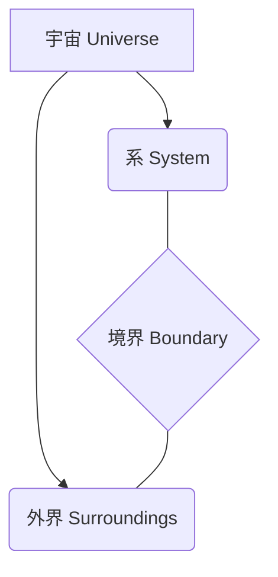

# 第1週：物理化学と熱力学入門

## 本日の内容
- 物理化学とは何か？
- 熱力学の基礎概念
  - 系 (System) と外界 (Surroundings)
  - 系の種類：開放系、閉鎖系、孤立系
  - 状態 (State) と状態量 (State Variables)
  - 状態量：示量変数と示強変数
  - 熱力学的過程 (Thermodynamic Process)
  - エネルギー (Energy) の概念

---

## 物理化学とは何か？

**物理化学 (Physical Chemistry)** とは、化学現象を物理学の原理と法則に基づいて理解し、記述する学問分野です。

- **マクロな視点**：熱力学、化学平衡、反応速度論など
- **ミクロな視点**：量子化学、統計力学、分光学など

物質の構造、性質、変化（反応）を定量的に扱います。

---

## 熱力学の基礎概念

### 系 (System) と外界 (Surroundings)

- **系 (System)**：考察の対象とする宇宙の一部。
- **外界 (Surroundings)**：系以外の宇宙のすべての部分。
- **境界 (Boundary)**：系と外界を隔てるもの。

---

### 系の種類

系の境界を通して、物質やエネルギーがどのように移動できるかによって分類されます。

1.  **開放系 (Open System)**：
    - 物質の移動：あり
    - エネルギーの移動：あり
    - 例：蓋のないビーカー内の熱湯

2.  **閉鎖系 (Closed System)**：
    - 物質の移動：なし
    - エネルギーの移動：あり
    - 例：密閉されたフラスコ内の反応物

3.  **孤立系 (Isolated System)**：
    - 物質の移動：なし
    - エネルギーの移動：なし
    - 例：断熱壁で囲まれた魔法瓶（理想的な場合）

---

### 状態 (State) と状態量 (State Variables)

- **状態 (State)**：系の巨視的な性質が特定の値で定まっている状況。
  - 例：25℃、1気圧における1モルの純粋な水

- **状態量 (State Variables / State Functions)**：系の状態を特徴づける物理量。
  - 状態量は経路に依存せず、現在の状態のみで決まる。
  - 例：温度 (T)、圧力 (P)、体積 (V)、物質量 (n)、内部エネルギー (U)、エンタルピー (H)、エントロピー (S)、ギブズエネルギー (G)

---

### 状態量：示量変数と示強変数

- **示量変数 (Extensive Variables)**：系の大きさに比例する状態量。
  - 加法性がある（部分の和が全体になる）。
  - 例：質量 (m)、体積 (V)、物質量 (n)、内部エネルギー (U)、エンタルピー (H)、エントロピー (S)

- **示強変数 (Intensive Variables)**：系の大きさに依存しない状態量。
  - 系のどの部分でも均一な値を持つ（平衡状態において）。
  - 例：温度 (T)、圧力 (P)、密度 (ρ)、濃度 (c)、モル体積 (Vm)

---

### 熱力学的過程 (Thermodynamic Process)

系がある状態から別の状態へ変化すること。

- **等温過程 (Isothermal Process)**：温度 (T) が一定
- **定圧過程 (Isobaric Process / Constant Pressure Process)**：圧力 (P) が一定
- **定容過程 (Isochoric Process / Constant Volume Process)**：体積 (V) が一定
- **断熱過程 (Adiabatic Process)**：系と外界の間で熱 (q) の移動がない
- **可逆過程 (Reversible Process)**：無限にゆっくりと変化し、いつでも逆向きに戻せる理想的な過程
- **不可逆過程 (Irreversible Process)**：現実の自発的な過程

---

## エネルギー (Energy) の概念

- **エネルギー (Energy)**：仕事をする能力、または熱を発生させる能力。
  - 熱力学における中心的な概念の一つ。
  - 様々な形態をとる（運動エネルギー、ポテンシャルエネルギー、化学エネルギー、熱エネルギーなど）。
  - エネルギーの総量は保存される（熱力学第一法則）。

---

## まとめ

- 物理化学は化学現象を物理的に理解する学問。
- 熱力学の基本用語：
  - 系、外界、境界
  - 開放系、閉鎖系、孤立系
  - 状態、状態量（示量変数、示強変数）
  - 熱力学的過程
- エネルギーは熱力学の重要な概念。

**次回：熱力学第一法則**
