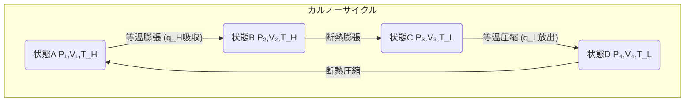

# 第4週：エントロピーと熱力学第二法則

## 本日の内容
- 自発過程 (Spontaneous Process)
- 熱力学第二法則 (The Second Law of Thermodynamics)
  - クラウジウスの原理
  - ケルビンの原理
- エントロピー (Entropy, S)
  - 熱力学的定義
  - 統計力学的解釈（ボルツマンの原理）
- カルノーサイクル (Carnot Cycle) と熱効率 (Thermal Efficiency)
- エントロピー変化の計算
  - 可逆過程と不可逆過程
  - クラウジウスの不等式

---

## 自発過程 (Spontaneous Process)

- **自発過程**：ある条件下で、外部からの作用なしに自然に進行する過程。
  - 例：
    - 高温物体から低温物体への熱の移動
    - 気体の真空への膨張
    - 鉄の錆び
    - 砂糖が水に溶ける
- 自発過程は一方向にしか進まない。逆向きの過程は非自発的。
- 熱力学第一法則（エネルギー保存則）だけでは、過程の自発性（方向性）を説明できない。
  - 例：床に落ちたボールが跳ね返る高さは徐々に低くなるが、エネルギーは保存されている。床からボールが自発的に高く跳ね上がることはない。

---

## 熱力学第二法則 (The Second Law of Thermodynamics)

過程の自発性（方向性）を規定する法則。いくつかの同等な表現がある。

### クラウジウスの原理 (Clausius Statement)
「熱は、他の変化を残さずに、低温の物体から高温の物体へ自発的に移動することはない。」
(Heat does not spontaneously flow from a colder body to a hotter body without external work being performed on the system.)

### ケルビンの原理 (Kelvin Statement)
「単一の熱源から熱を受け取り、それをすべて仕事に変えるサイクルは不可能である。」
(It is impossible for any cyclic process to convert heat entirely into work from a single heat reservoir.)
つまり、100%の熱効率を持つ熱機関は作れない。

---

## エントロピー (Entropy, S)

- **エントロピー**：系の「乱雑さ」や「無秩序さ」の度合いを示す状態量。
  - 記号：$S$
  - 単位：J/K (ジュール毎ケルビン)

### 熱力学的定義 (Clausius Definition)
可逆過程において、系が温度 $T$ で微小な熱量 $dq_{rev}$ を吸収するときの微小エントロピー変化 $dS$ は：
$$ dS = \frac{dq_{rev}}{T} $$
有限の変化では：
$$ \Delta S = \int_{i}^{f} \frac{dq_{rev}}{T} $$
エントロピーは状態量なので、$\Delta S$ は経路に依存しない。

---

### 統計力学的解釈 (Boltzmann's Principle)

エントロピー $S$ は、系がとりうるミクロな状態の数 $W$ (場合の数、熱力学的確率) と関連付けられる。
$$ S = k \ln W $$
ここで、
- $k$：ボルツマン定数 ($k = R/N_A \approx 1.38 \times 10^{-23} \text{ J/K}$)
- $W$：与えられたマクロ状態に対応するミクロ状態の数。

$W$ が大きいほど（より多くの配置が可能であるほど）、エントロピーは大きい。
自発的変化は、より確率の高い状態（$W$ が大きい状態）へ向かう傾向がある。

---

## カルノーサイクル (Carnot Cycle)

- **カルノーサイクル**：2つの等温過程と2つの断熱過程からなる理想的な可逆サイクル。
  - 高温熱源 ($T_H$) と低温熱源 ($T_L$) の間で動作する熱機関の理論モデル。

1.  **等温膨張 (A→B)**：温度 $T_H$ で熱 $q_H$ を吸収し、気体が膨張して仕事をする。
2.  **断熱膨張 (B→C)**：気体が断熱的に膨張し、温度が $T_H$ から $T_L$ に下がる。
3.  **等温圧縮 (C→D)**：温度 $T_L$ で熱 $q_L$ を放出し、気体が圧縮される。
4.  **断熱圧縮 (D→A)**：気体が断熱的に圧縮され、温度が $T_L$ から $T_H$ に戻る。

---

### 熱効率 (Thermal Efficiency, $\eta$)

- **熱機関の熱効率 ($\eta$)**：得られた仕事 $w_{net}$ と吸収した熱 $q_H$ の比。
  $$ \eta = \frac{|w_{net}|}{|q_H|} = \frac{|q_H| - |q_L|}{|q_H|} = 1 - \frac{|q_L|}{|q_H|} $$
- カルノーサイクルの場合、可逆過程なのでエントロピー変化はゼロ ($\Delta S_{cycle} = 0$)。
  $$ \frac{q_H}{T_H} + \frac{q_L}{T_L} = 0 \quad \Rightarrow \quad \frac{|q_L|}{|q_H|} = \frac{T_L}{T_H} $$
- **カルノー効率 ($\eta_C$)**：
  $$ \eta_C = 1 - \frac{T_L}{T_H} $$
- **カルノーの定理**：同じ高温熱源と低温熱源の間で動作するすべての熱機関の中で、可逆熱機関（カルノー機関）の効率が最大である。不可逆機関の効率はカルノー効率より常に小さい。

---

## エントロピー変化の計算

### 可逆過程
- **等温過程**: $T$ 一定
  $$ \Delta S = \int \frac{dq_{rev}}{T} = \frac{1}{T} \int dq_{rev} = \frac{q_{rev}}{T} $$
  理想気体の可逆等温膨張/圧縮：$q_{rev} = -w_{rev} = nRT \ln(V_f/V_i)$
  $$ \Delta S = nR \ln \frac{V_f}{V_i} $$
- **定圧過程**: $P$ 一定, $dq_{rev} = C_P dT$
  $$ \Delta S = \int_{T_i}^{T_f} \frac{C_P}{T} dT = C_P \ln \frac{T_f}{T_i} \quad (\text{if } C_P \text{ is constant}) $$
- **定容過程**: $V$ 一定, $dq_{rev} = C_V dT$
  $$ \Delta S = \int_{T_i}^{T_f} \frac{C_V}{T} dT = C_V \ln \frac{T_f}{T_i} \quad (\text{if } C_V \text{ is constant}) $$
- **断熱可逆過程**: $dq_{rev} = 0$
  $$ \Delta S = 0 $$ (等エントロピー過程)

---

### クラウジウスの不等式 (Clausius Inequality)

任意のサイクル過程において、
$$ \oint \frac{dq}{T} \le 0 $$
- 等号は可逆サイクルの場合。
- 不等号は不可逆サイクルの場合。

この不等式から、孤立系におけるエントロピー変化について重要な結論が得られる。
孤立系では $dq=0$ なので、
- 可逆過程：$dS = 0 \quad \Rightarrow \quad \Delta S_{isolated} = 0$
- 不可逆過程（自発過程）：$dS > dq_{irrev}/T$
  孤立系では $dq_{irrev}=0$ なので、$dS > 0 \quad \Rightarrow \quad \Delta S_{isolated} > 0$

**熱力学第二法則の別の表現**：
「孤立系において、自発的な変化は常にエントロピーが増大する方向に起こる。」
$$ \Delta S_{isolated} \ge 0 $$
等号は可逆過程（平衡状態）、不等号は不可逆過程（自発過程）。

宇宙全体を孤立系とみなすと、宇宙のエントロピーは増大し続けている。
$\Delta S_{universe} = \Delta S_{system} + \Delta S_{surroundings} \ge 0$

---

## まとめ

- 自発過程は一方向に進む。熱力学第二法則がその方向性を規定する。
- エントロピー $S$ は乱雑さの尺度 ($dS = dq_{rev}/T$, $S = k \ln W$)。
- カルノーサイクルは理想的な熱機関のモデルで、その効率は $\eta_C = 1 - T_L/T_H$。
- クラウジウスの不等式 $\oint dq/T \le 0$ から、孤立系のエントロピーは増大する ($\Delta S_{isolated} \ge 0$) ことが導かれる。
- これが自発変化の方向性を決定する。

**次回：熱力学第三法則とギブズ自由エネルギー**
