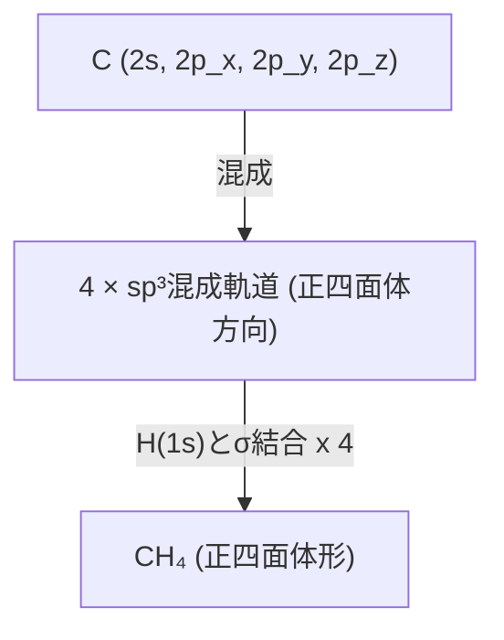

# 第17週：多原子分子の構造と結合

## 本日の内容
- 多原子分子の複雑さ
- 原子価結合法 (VB法) の拡張
  - 混成軌道 (Hybrid Orbitals)
    - sp混成 (直線形)
    - sp²混成 (平面三角形)
    - sp³混成 (正四面体形)
    - d軌道を含む混成 (sp³d, sp³d²)
  - σ結合とπ結合の区別
- 分子の形を予測するVSEPR理論 (Valence Shell Electron Pair Repulsion Theory)
  - 基本的な考え方
  - 電子対の配置と分子の形
  - 孤立電子対の影響
- 分子軌道法 (MO法) の多原子分子への適用 - 概観
  - 対称適合線形結合 (SALC)
  - ヒュッケルMO法 (共役π電子系)

---

## 多原子分子の複雑さ

二原子分子に比べて、3つ以上の原子からなる**多原子分子**では、
- 原子間の結合の数が増える。
- 結合角など、分子の**立体構造（3次元的な形）**が重要になる。
- 結合の性質も多様になる（例：単結合、二重結合、三重結合、非局在化結合）。

これらの特徴を理解するために、VB法やMO法を拡張して適用する。

---

## 原子価結合法 (VB法) の拡張：混成軌道

VB法では、共有結合は原子価軌道の重なりによって形成される。
しかし、例えばメタン (CH₄) の場合、炭素原子の基底状態の電子配置 ($1s^2 2s^2 2p_x^1 2p_y^1$) からは、等価な4つのC-H結合と正四面体構造を説明できない。
この問題を解決するために、ライナス・ポーリングが**混成軌道 (Hybrid Orbitals)** の概念を導入した。

**混成 (Hybridization)**：中心原子の複数の種類の原子軌道（例：s軌道とp軌道）が数学的に混合（線形結合）して、新しい等価な方向性を持つ軌道（混成軌道）を形成すること。
- 混成軌道は、より大きな軌道の重なりと強い結合を形成するのに有利な方向を向く。
- 混成に必要なエネルギーは、強い結合形成による安定化で補われる。

---

### sp³混成 (メタン CH₄, 正四面体形)
- 炭素原子の1つの2s軌道と3つの2p軌道 ($2p_x, 2p_y, 2p_z$) が混成し、4つの等価な**sp³混成軌道**を形成する。
- 各sp³混成軌道は、正四面体の頂点方向を向き、互いに109.5°の角度をなす。
- 各sp³混成軌道が水素の1s軌道と重なり、4つの等価なC-H σ結合を形成。
- 例：メタン (CH₄)、アンモニア (NH₃) のN、水 (H₂O) のO (孤立電子対も混成軌道に入る)

---

### sp²混成 (エチレン C₂H₄, 平面三角形)
- 炭素原子の1つの2s軌道と2つの2p軌道（例：$2p_x, 2p_y$）が混成し、3つの等価な**sp²混成軌道**を形成する。
- 各sp²混成軌道は、同一平面上で互いに120°の角度をなす（平面三角形の頂点方向）。
- 残った1つのp軌道（例：$2p_z$）は混成に関与せず、sp²混成軌道が作る平面に垂直な方向を向く。
- エチレン (C₂H₄) の場合：
  - 各炭素原子がsp²混成。
  - 2つの炭素原子間で、1つのsp²混成軌道同士がσ結合を形成。
  - 各炭素の残りの2つのsp²混成軌道が水素の1s軌道とC-H σ結合を形成。
  - 各炭素の残ったp$_z$軌道同士が側面で重なり、**π結合 (pi bond)** を形成。
  - C=C 二重結合は、1つのσ結合と1つのπ結合からなる。
- 例：エチレン (C₂H₄)、BF₃ (三フッ化ホウ素)

---

### sp混成 (アセチレン C₂H₂, 直線形)
- 炭素原子の1つの2s軌道と1つの2p軌道（例：$2p_z$）が混成し、2つの等価な**sp混成軌道**を形成する。
- 各sp混成軌道は、互いに180°の角度をなす（直線形）。
- 残った2つのp軌道（例：$2p_x, 2p_y$）は混成に関与せず、互いに垂直かつ結合軸に垂直な方向を向く。
- アセチレン (C₂H₂) の場合：
  - 各炭素原子がsp混成。
  - 2つの炭素原子間で、1つのsp混成軌道同士がσ結合を形成。
  - 各炭素の残りの1つのsp混成軌道が水素の1s軌道とC-H σ結合を形成。
  - 各炭素の残った2組のp軌道 ($p_x$同士, $p_y$同士) がそれぞれ側面で重なり、2つのπ結合を形成。
  - C≡C 三重結合は、1つのσ結合と2つのπ結合からなる。
- 例：アセチレン (C₂H₂)、BeCl₂ (塩化ベリリウム)

---

### d軌道を含む混成
中心原子が第3周期以降の元素の場合、空のd軌道も混成に関与できる。
- **sp³d混成**: 5つの混成軌道。三方両錐形 (trigonal bipyramidal)。例：PCl₅
- **sp³d²混成**: 6つの混成軌道。正八面体形 (octahedral)。例：SF₆

### σ結合とπ結合の区別
- **σ結合 (Sigma Bond)**: 結合軸に対して円筒対称な結合。軌道が軸上で正面から重なる。単結合は常にσ結合。
- **π結合 (Pi Bond)**: 結合軸を含む節面を持つ結合。p軌道などが側面で重なる。二重結合は1つのσ結合と1つのπ結合、三重結合は1つのσ結合と2つのπ結合からなる。
  - π結合はσ結合より弱い。π結合の存在は分子の回転を束縛する。

---

## VSEPR理論 (Valence Shell Electron Pair Repulsion Theory)
**原子価殻電子対反発理論**：分子の形を予測するための簡単な経験則。
ギレスピーとナイホルムによって提唱された。

**基本的な考え方**:
1.  中心原子の周りの原子価殻にある電子対（結合電子対および孤立電子対）は、互いに静電的に反発しあい、その反発を最小にするように空間的に配置される。
2.  孤立電子対は、結合電子対よりも空間的に広がりが大きく、より強い反発力を持つ。
    反発力の強さ： (孤立-孤立) > (孤立-結合) > (結合-結合)
3.  二重結合や三重結合は、形の決定においては単一の結合電子対領域として扱う（1つの方向を占める）。

---

### 電子対の配置と分子の形
中心原子周りの総電子対数（結合電子対＋孤立電子対）によって、基本的な電子対の配置が決まる。
分子の形は、孤立電子対を除いた原子核の位置だけで決まる。

| 総電子対数 | 電子対の基本配置 | 結合電子対数 | 孤立電子対数 | 分子の形       | 結合角(理想) | 例             |
|------------|------------------|--------------|--------------|----------------|--------------|----------------|
| 2          | 直線形           | 2            | 0            | 直線形         | 180°         | BeCl₂, CO₂     |
| 3          | 平面三角形       | 3            | 0            | 平面三角形     | 120°         | BF₃, SO₃       |
|            |                  | 2            | 1            | 折れ線形       | <120°        | SO₂, O₃        |
| 4          | 正四面体形       | 4            | 0            | 正四面体形     | 109.5°       | CH₄, NH₄⁺      |
|            |                  | 3            | 1            | 三角錐形       | <109.5°      | NH₃, PCl₃      |
|            |                  | 2            | 2            | 折れ線形       | <109.5°      | H₂O, OF₂       |
| 5          | 三方両錐形       | 5            | 0            | 三方両錐形     | 90°, 120°    | PCl₅           |
|            |                  | 4            | 1            | シーソー形     |              | SF₄            |
|            |                  | 3            | 2            | T字形          |              | ClF₃           |
|            |                  | 2            | 3            | 直線形         |              | XeF₂           |
| 6          | 正八面体形       | 6            | 0            | 正八面体形     | 90°          | SF₆, [SiF₆]²⁻  |
|            |                  | 5            | 1            | 四角錐形       |              | BrF₅           |
|            |                  | 4            | 2            | 平面四角形     |              | XeF₄           |

---

## MO法の多原子分子への適用 - 概観

多原子分子に対してもMO法は適用できる。
- 分子軌道は、分子内の全ての原子の原子軌道の線形結合 (LCAO) で表される。
  $$ \psi_{MO} = \sum_i c_i \phi_i $$
- 分子の対称性を利用すると計算が簡略化できる（群論の応用）。
  - **対称適合線形結合 (Symmetry Adapted Linear Combinations, SALC)**：同じ対称性を持つ原子軌道同士だけが混合して分子軌道を形成する。
- 例：水 (H₂O)
  - Oの2s, 2p軌道と2つのHの1s軌道からMOを形成。
  - 分子の対称性 (C₂ᵥ) を考慮して軌道を分類し、エネルギー準位図を作成。

### ヒュッケルMO法 (Hückel MO Theory)
- 平面共役π電子系（例：ベンゼン、ブタジエン）のπ分子軌道を近似的に扱うための簡便なMO法。
- π電子のみを考慮し、σ骨格は固定されていると仮定。
- いくつかの大胆な近似（重なり積分の無視、クーロン積分と共鳴積分のパラメータ化）を行う。
- π電子のエネルギー準位、π結合エネルギー、非局在化エネルギーなどを計算できる。
- 共鳴や芳香族性の理解に貢献。

---

## まとめ

- 多原子分子の構造と結合を理解するために、VB法とMO法が用いられる。
- **VB法と混成軌道**:
  - 中心原子のAOが混成して、特定の方向性を持つ混成軌道を形成。
  - sp³, sp², sp混成などが分子の形（正四面体、平面三角形、直線形）に対応。
  - σ結合とπ結合の区別が明確になる。
- **VSEPR理論**:
  - 原子価電子対の反発を最小にするように分子の形が決まるとする経験則。
  - 結合電子対と孤立電子対の数を基に、分子の立体構造を簡便に予測できる。
- **MO法**:
  - 多原子分子全体に広がる分子軌道を考える。対称性を利用したSALCが有効。
  - ヒュッケル法は共役π電子系の扱いに有用。

**次回：分子分光学**
