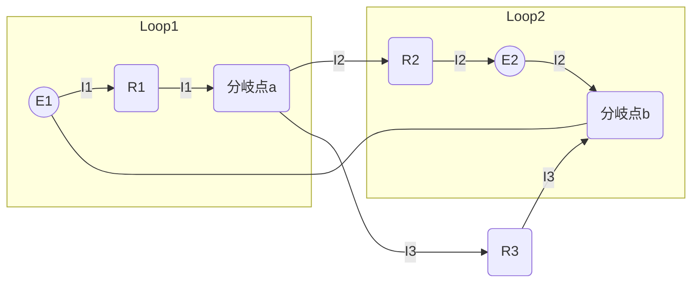

# 電磁気学 第08週: キルヒホッフの法則と複雑な回路

---

## この週の学習目標
- キルヒホッフの第一法則（電流則）を理解し、回路の分岐点に適用できるようになる。
- キルヒホッフの第二法則（電圧則）を理解し、閉回路に適用できるようになる。
- これらの法則を用いて、複雑な直流回路（抵抗と電源からなる回路網）を解析し、各部の電流や電圧を求められるようになる。
- ホイートストンブリッジ回路の原理と平衡条件を理解する。

---

## 導入
- 前週までは、比較的単純な抵抗の直列・並列接続について学びました。しかし、実際の電気回路はもっと複雑な構造を持つことがあります。
- そのような複雑な回路網では、単純な合成抵抗の計算だけでは各部の電流や電圧を求めることが困難です。
- 今週は、どんな複雑な直流回路にも適用できる強力なツールである「キルヒホッフの法則」を学びます。

---

## 1. キルヒホッフの法則 (Kirchhoff's Laws)
ドイツの物理学者グスタフ・キルヒホッフによって発見された、電気回路における電流と電圧に関する2つの基本的な法則です。

### 1.1. キルヒホッフの第一法則 (電流則、Kirchhoff's Current Law - KCL)
- **法則**: 電気回路の任意の分岐点（接合点、ノード）において、流れ込む電流の総和と流れ出す電流の総和は等しい。
  $\sum I_{in} = \sum I_{out}$
- 言い換えると、分岐点に流れ込む電流の代数和はゼロである（流れ込む向きを正、流れ出す向きを負とする）。
  $\sum I = 0$
- **物理的意味**: 電荷の保存則に基づいています。分岐点で電荷が蓄積されたり消滅したりすることはないため、入ってくる電荷の量と出ていく電荷の量は等しくなければなりません。

#### 例:
- ある分岐点に電流 $I_1, I_2$ が流れ込み、$I_3$ が流れ出している場合：
  $I_1 + I_2 = I_3$  または  $I_1 + I_2 - I_3 = 0$

### 1.2. キルヒホッフの第二法則 (電圧則、Kirchhoff's Voltage Law - KVL)
- **法則**: 電気回路の任意の閉回路（ループ）において、起電力の総和と電圧降下の総和は等しい。
  $\sum E = \sum RI$
- 言い換えると、閉回路を一周するときの電位の変化の代数和はゼロである。
  $\sum \Delta V = 0$
- **物理的意味**: エネルギーの保存則（または電位の単一性）に基づいています。閉回路を一周して元の点に戻ると、電位も元に戻るため、電位差の合計はゼロになります。

#### 電圧則の適用ルール:
1. 閉回路と周回方向（時計回りまたは反時計回り）を任意に定める。
2. 回路素子を通過するときの電位の変化を考える。
   - **抵抗**:
     - 周回方向と電流の向きが同じ場合：電圧降下 $-RI$
     - 周回方向と電流の向きが逆の場合：電圧上昇 $+RI$
   - **電源（起電力 $E$）**:
     - 周回方向が負極から正極へ向かう場合：起電力（電位上昇） $+E$
     - 周回方向が正極から負極へ向かう場合：起電力（電位降下） $-E$
3. 閉回路一周の電位変化の代数和をゼロとおく。

---

## 2. キルヒホッフの法則を用いた回路解析の手順
1. **電流の仮定**: 各枝路に流れる電流の向きを任意に仮定し、$I_1, I_2, \dots$ とおく。
   （仮定した向きと実際の向きが逆だった場合、計算結果が負の値として得られる）
2. **電流則の適用**: 回路中の分岐点の数から1を引いた数だけ、独立な電流則の式を立てる。
3. **電圧則の適用**: 回路中の独立な閉回路を選び、それぞれについて電圧則の式を立てる。必要な式の数は、未知の電流の数から電流則で立てた式の数を引いたもの。
4. **連立方程式の求解**: 得られた連立一次方程式を解いて、未知の電流 $I_1, I_2, \dots$ を求める。
5. **電圧の計算**: 必要であれば、オームの法則 $V=RI$ を用いて各抵抗の電圧降下などを計算する。

---

## 3. ホイートストンブリッジ (Wheatstone Bridge)
- 4つの抵抗 $R_1, R_2, R_3, R_x$ をひし形に接続し、対角線の一方に電源、もう一方に検流計G（微小電流を検出する計器）を接続した回路。
- 未知の抵抗値 $R_x$ を精密に測定するために用いられる。

```mermaid
graph LR
    A ---|R1| B
    A ---|R3| D
    B ---|R2| C
    D ---|Rx| C
    B ---|G(検流計)| D
    subgraph 電源
        E1---A
        E2---C
    end
    E1(( )) --起電力E-- E2(( ))
```

### 3.1. 平衡条件
- 検流計Gに電流が流れない状態（$I_G = 0$）をブリッジが「平衡している」という。
- このとき、点Bと点Dの電位は等しい ($V_B = V_D$)。
- $V_B = V_D$ より、AB間の電圧降下とAD間の電圧降下が等しく、BC間の電圧降下とDC間の電圧降下が等しくなる。
  $R_1 I_1 = R_3 I_3$  (ここで $I_1$ は $R_1, R_2$ を流れる電流、$I_3$ は $R_3, R_x$ を流れる電流)
  $R_2 I_1 = R_x I_3$
- 上の2式から $I_1, I_3$ を消去すると、
  $\frac{R_1}{R_2} = \frac{R_3}{R_x}$  または  $R_1 R_x = R_2 R_3$
- これがホイートストンブリッジの平衡条件である。既知の抵抗 $R_1, R_2, R_3$ を調整して平衡状態にすれば、$R_x$ を求めることができる。
  $R_x = R_3 \frac{R_2}{R_1}$

---

## 例題と解説
### 例題1
図のような回路で、各抵抗を流れる電流 $I_1, I_2, I_3$ を求めよ。
$E_1 = 6\mathrm{V}, E_2 = 3\mathrm{V}, R_1 = 1\Omega, R_2 = 2\Omega, R_3 = 3\Omega$


(電流の向きは仮定) $I_1$ は $E_1$ から出て $R_1$ を通り $J_1$ へ。$I_2$ は $J_1$ から $R_2, E_2$ を通り $J_2$ へ。$I_3$ は $J_1$ から $R_3$ を通り $J_2$ へ。

- **解説と解答**
  1. **電流の仮定**: 図のように $I_1, I_2, I_3$ を仮定する。
  2. **電流則 (分岐点J1)**: $I_1 = I_2 + I_3$  --- (1)
  3. **電圧則**:
     - 左の閉回路 (E1-R1-R3-E1、時計回り): $E_1 - R_1 I_1 - R_3 I_3 = 0 \implies 6 - 1 I_1 - 3 I_3 = 0$ --- (2)
     - 右の閉回路 (R2-E2-R3-R2、反時計回り): $R_3 I_3 - E_2 - R_2 I_2 = 0 \implies 3 I_3 - 3 - 2 I_2 = 0$ --- (3)
     (または、E1-R1-R2-E2-E1、時計回り: $E_1 - R_1 I_1 - R_2 I_2 - E_2 = 0 \implies 6 - I_1 - 2I_2 - 3 = 0 \implies 3 - I_1 - 2I_2 = 0$)

  4. **連立方程式の求解**:
     (1) を (2) に代入: $6 - (I_2+I_3) - 3I_3 = 0 \implies 6 - I_2 - 4I_3 = 0$ --- (4)
     (3) より $2I_2 = 3I_3 - 3 \implies I_2 = \frac{3}{2}I_3 - \frac{3}{2}$
     これを (4) に代入: $6 - (\frac{3}{2}I_3 - \frac{3}{2}) - 4I_3 = 0$
     $6 - \frac{3}{2}I_3 + \frac{3}{2} - 4I_3 = 0$
     $\frac{15}{2} - \frac{11}{2}I_3 = 0 \implies 11I_3 = 15 \implies I_3 = \frac{15}{11} \mathrm{A} \approx 1.36 \mathrm{A}$
     $I_2 = \frac{3}{2} \left(\frac{15}{11}\right) - \frac{3}{2} = \frac{45}{22} - \frac{33}{22} = \frac{12}{22} = \frac{6}{11} \mathrm{A} \approx 0.55 \mathrm{A}$
     $I_1 = I_2 + I_3 = \frac{6}{11} + \frac{15}{11} = \frac{21}{11} \mathrm{A} \approx 1.91 \mathrm{A}$

  **答**: $I_1 = \frac{21}{11} \mathrm{A}$, $I_2 = \frac{6}{11} \mathrm{A}$, $I_3 = \frac{15}{11} \mathrm{A}$ (全て正なので仮定した向きで正しい)

---

## 演習問題
1. 図の回路において、抵抗 $R_2$ を流れる電流の大きさと向きを求めよ。
   $E_1 = 12\mathrm{V}, E_2 = 6\mathrm{V}, R_1 = 2\Omega, R_2 = 4\Omega, R_3 = 6\Omega$.
   (回路図は例題1と同様の構成とする)
2. ホイートストンブリッジ回路で、$R_1 = 10\Omega, R_2 = 20\Omega, R_3 = 30\Omega$ のとき、ブリッジを平衡させるための未知抵抗 $R_x$ の値を求めよ。
3. キルヒホッフの第一法則と第二法則が、それぞれ何の保存則に基づいているか説明せよ。

---

## まとめ
- キルヒホッフの第一法則（電流則）: 分岐点での電流の総和はゼロ ($\sum I = 0$) ← 電荷保存則
- キルヒホッフの第二法則（電圧則）: 閉回路での電位変化の総和はゼロ ($\sum \Delta V = 0$) ← エネルギー保存則
- これらの法則を用いることで、複雑な回路網の電流や電圧を解析できる。
- ホイートストンブリッジは抵抗測定に用いられ、平衡条件は $R_1 R_x = R_2 R_3$。
- 次週は「電流と磁場（直線電流、円形電流が作る磁場）」について学び、磁気の現象に入っていきます。

---

## 参考資料
- 高校物理の教科書（電磁気分野）
- (その他参考書やウェブサイトなど)
