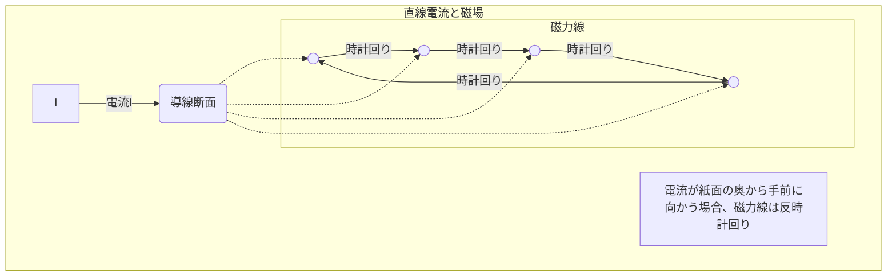

# 電磁気学 第09週: 電流と磁場（直線・円形・ソレノイド電流）

---

## この週の学習目標
- 電流の磁気作用（エルステッドの発見）を理解する。
- 磁場、磁束密度、磁力線の概念を理解する。
- 直線電流が作る磁場の強さと向きを計算できるようになる（右ねじの法則）。
- 円形電流が中心に作る磁場の強さと向きを計算できるようになる。
- ソレノイドコイルが内部に作る磁場の強さと向きを計算できるようになる。
- 磁場の重ね合わせの原理を理解する。

---

## 導入
- これまで、電気現象として静電気や直流回路について学んできました。電荷が存在すると電場が生じ、電荷が動くと電流が流れます。
- 1820年、デンマークの物理学者エルステッドは、電流が流れている導線の近くに置いた方位磁針が振れることを発見しました。これは「電流がその周りに磁場を作る」という、電気と磁気の関連性を示す最初の発見（電流の磁気作用）でした。
- 今週は、様々な形の電流がどのような磁場を作るのかを学びます。

---

## 1. 磁場 (Magnetic Field) と磁力線
### 1.1. 磁場とは
- 磁石や電流の周りに存在し、他の磁石や電流、運動する電荷に磁力を及ぼす空間の性質。
- 磁場の強さと向きを持つベクトル量。
- 磁場の強さを表す量として、磁場の強さ $H$ [A/m] (アンペア毎メートル) と磁束密度 $B$ [T] (テスラ) がある。
  - $B = \mu H$ の関係がある。$\mu$ は透磁率 [N/A$^2$ または H/m]。
  - 真空の透磁率 $\mu_0 = 4\pi \times 10^{-7}$ N/A$^2$。

### 1.2. 磁場の向き
- 磁場中に置いた方位磁針のN極が指す向きを、その点の磁場の向きとする。

### 1.3. 磁力線
- 磁場の様子を視覚的に表すために用いられる曲線。
- **性質**:
    1. 磁力線上の任意の点での接線の向きが、その点の磁場の向きを表す。
    2. 磁力線の密度（単位面積を垂直に貫く本数）が、その場所の磁場の強さを表す（密なほど磁場が強い）。
    3. 磁力線はN極から出てS極に入る（磁石の場合）。電流が作る磁場では閉曲線となることが多い。
    4. 磁力線同士は交わったり、途中で途切れたり、枝分かれしたりしない。

---

## 2. 直線電流が作る磁場
### 2.1. 磁場の強さと向き
- 無限に長い直線導線に電流 $I$ [A] が流れるとき、導線から垂直距離 $r$ [m] の点にできる磁場の強さ $H$ [A/m] は、
  $H = \frac{I}{2\pi r}$
- 磁束密度 $B$ [T] は、
  $B = \mu H = \frac{\mu I}{2\pi r}$
  (真空中または空気中では $\mu \approx \mu_0$ として $B = \frac{\mu_0 I}{2\pi r}$)

### 2.2. 右ねじの法則 (アンペールの右ねじの法則)
- 磁場の向きは、電流の向きに右ねじを進めるとき、ねじが回転する向き。
- または、電流の向きに右手の親指を向けると、残りの指が巻く向きが磁場の向き。
- 磁力線は、導線を中心とする同心円状になる。

---

## 3. 円形電流が作る磁場
### 3.1. 円の中心における磁場の強さと向き
- 半径 $r$ [m] の円形コイルに電流 $I$ [A] が流れるとき、円の中心にできる磁場の強さ $H$ [A/m] は、
  $H = \frac{I}{2r}$
- 磁束密度 $B$ [T] は、
  $B = \mu H = \frac{\mu I}{2r}$
- コイルが $N$ 回巻きの場合、磁場は $N$ 倍になる。
  $H = \frac{NI}{2r}$,  $B = \frac{\mu NI}{2r}$

### 3.2. 磁場の向き
- 右ねじの法則を用いる。円形電流の向きに右手の4本の指を合わせると、親指が向く方向が円の中心における磁場の向き。
- 磁力線はコイルの面を垂直に貫き、コイルから離れると広がっていく。

---

## 4. ソレノイドコイルが作る磁場
### 4.1. ソレノイドとは
- 導線を円筒状に長く密に巻いたコイル。

### 4.2. ソレノイド内部の磁場
- ソレノイドの長さが直径に比べて十分に長い場合、ソレノイド内部の磁場はほぼ一様（場所によらず強さと向きが同じ）になる。
- 単位長さあたりの巻き数を $n$ [回/m]（総巻き数 $N$、ソレノイドの長さ $L$ のとき $n = N/L$）、電流を $I$ [A] とすると、ソレノイド内部の磁場の強さ $H$ [A/m] は、
  $H = nI$
- 磁束密度 $B$ [T] は、
  $B = \mu H = \mu nI$

### 4.3. 磁場の向き
- 右ねじの法則を用いる。コイルの電流の向きに右手の4本の指を合わせると、親指が向く方向がソレノイド内部の磁場の向き。
- ソレノイドが作る磁力線は、棒磁石が作る磁力線と非常によく似ている。ソレノイドの一端がN極、他端がS極のようになる。

---

## 5. 磁場の重ね合わせの原理
- 複数の電流が作る磁場は、それぞれの電流が単独でその場所に作る磁場をベクトル的に足し合わせたものになる。
  $\vec{B}_{total} = \vec{B_1} + \vec{B_2} + \dots$
- これにより、複雑な形状の電流が作る磁場も計算できる（場合がある）。

---

## 例題と解説
### 例題1
- 無限に長い直線導線に $10 \mathrm{A}$ の電流が流れている。導線から $0.20 \mathrm{m}$ 離れた点の磁場の強さ $H$ と磁束密度 $B$ を求めよ。真空の透磁率を $\mu_0 = 4\pi \times 10^{-7} \mathrm{N/A^2}$ とする。
- **解説と解答**
  $H = \frac{I}{2\pi r} = \frac{10 \mathrm{A}}{2\pi \times 0.20 \mathrm{m}} = \frac{10}{0.4\pi} \mathrm{A/m} = \frac{25}{\pi} \mathrm{A/m} \approx 7.96 \mathrm{A/m}$
  $B = \mu_0 H = (4\pi \times 10^{-7} \mathrm{N/A^2}) \times \frac{25}{\pi} \mathrm{A/m} = 100 \times 10^{-7} \mathrm{T} = 1.0 \times 10^{-5} \mathrm{T}$

### 例題2
- 半径 $5.0 \mathrm{cm}$ の円形コイルに $2.0 \mathrm{A}$ の電流を流した。コイルの中心における磁場の強さ $H$ と磁束密度 $B$ を求めよ。コイルは1回巻きとし、真空の透磁率を用いる。
- **解説と解答**
  $r = 5.0 \mathrm{cm} = 0.050 \mathrm{m}$
  $H = \frac{I}{2r} = \frac{2.0 \mathrm{A}}{2 \times 0.050 \mathrm{m}} = \frac{2.0}{0.10} \mathrm{A/m} = 20 \mathrm{A/m}$
  $B = \mu_0 H = (4\pi \times 10^{-7} \mathrm{N/A^2}) \times 20 \mathrm{A/m} = 80\pi \times 10^{-7} \mathrm{T} \approx 2.5 \times 10^{-5} \mathrm{T}$

### 例題3
- 長さ $0.50 \mathrm{m}$ のソレノイドに導線を1000回巻き、 $0.50 \mathrm{A}$ の電流を流した。ソレノイド内部の磁場の強さ $H$ と磁束密度 $B$ を求めよ。真空の透磁率を用いる。
- **解説と解答**
  単位長さあたりの巻き数 $n = \frac{N}{L} = \frac{1000 \text{回}}{0.50 \mathrm{m}} = 2000 \text{回/m}$
  $H = nI = (2000 \text{回/m}) \times 0.50 \mathrm{A} = 1000 \mathrm{A/m}$
  $B = \mu_0 H = (4\pi \times 10^{-7} \mathrm{N/A^2}) \times 1000 \mathrm{A/m} = 4\pi \times 10^{-4} \mathrm{T} \approx 1.26 \times 10^{-3} \mathrm{T}$

---

## 演習問題
1. 地球の磁場（地磁気）の水平成分の強さが約 $24 \mathrm{A/m}$ である。これをテスラ単位で表せ（真空の透磁率を用いる）。
2. 2本の平行な直線導線A, Bが $0.10 \mathrm{m}$ 離れて置かれている。導線Aには紙面の手前から奥へ $5.0 \mathrm{A}$、導線Bには紙面の奥から手前へ $5.0 \mathrm{A}$ の電流が流れている。導線A, Bの中点Pにおける合成磁場の強さと向きを求めよ。
3. 100回巻きで半径 $10 \mathrm{cm}$ の円形コイルの中心に、強さ $6.0 \times 10^{-4} \mathrm{T}$ の磁場を作りたい。何アンペアの電流を流せばよいか。

---

## まとめ
- 電流はその周りに磁場を作る（電流の磁気作用）。
- 直線電流が作る磁場: $H = I/(2\pi r)$、向きは右ねじの法則。
- 円形電流が中心に作る磁場: $H = NI/(2r)$、向きは右ねじの法則。
- ソレノイドが内部に作る磁場: $H = nI$、向きは右ねじの法則。
- 磁束密度 $B = \mu H$。
- 複数の電流が作る磁場はベクトル的に重ね合わせられる。
- 次週は「電流が磁場から受ける力（ローレンツ力の一部）」について学びます。

---

## 参考資料
- 高校物理の教科書（電磁気分野）
- (その他参考書やウェブサイトなど)
