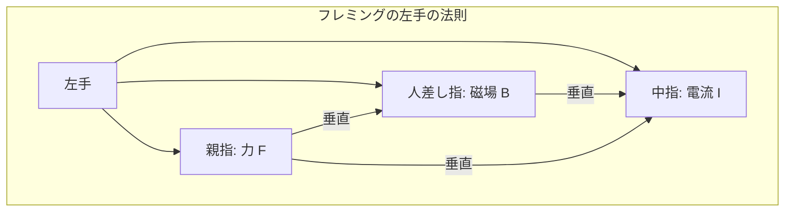

# 電磁気学 第10週: 電流が磁場から受ける力（ローレンツ力）

---

## この週の学習目標
- 磁場中の電流が力を受ける現象を理解する。
- 電流が磁場から受ける力の大きさの式 ($F=IBL\sin\theta$) を理解し、適用できるようになる。
- フレミングの左手の法則を理解し、力の向きを決定できるようになる。
- 荷電粒子が磁場から受ける力（ローレンツ力）の式 ($f=qvB\sin\theta$) を理解する。
- 平行な直線電流間にはたらく力の向きと大きさを説明できるようになる。
- 電流計や電動機（モーター）の基本的な原理を理解する。

---

## 導入
- 前週は、電流がその周りに磁場を作ることを学びました（電流の磁気作用）。
- 今週は、その逆の現象、すなわち「磁場中に置かれた電流が力を受ける」という現象について学びます。この力は電磁力とも呼ばれ、モーター（電動機）など、私たちの生活に欠かせない多くの技術の基本原理となっています。
- また、個々の荷電粒子が磁場中を運動するときに受ける力（ローレンツ力）についても触れます。

---

## 1. 電流が磁場から受ける力
### 1.1. 力の発生
- 磁場中に置かれた導線に電流を流すと、導線は磁場から力を受ける。
- この力の向きは、電流の向きと磁場の向きの両方に垂直である。

### 1.2. 力の大きさ
- 磁束密度 $B$ [T] の一様な磁場中に、磁場の向きと角度 $\theta$ をなすように置かれた長さ $L$ [m] の直線導線に、電流 $I$ [A] が流れているとき、導線が受ける力の大きさ $F$ [N] は、
  $F = IBL\sin\theta$
- 特に、電流の向きと磁場の向きが垂直 ($\theta = 90^\circ, \sin\theta = 1$) のとき、力の大きさは最大となる。
  $F_{max} = IBL$
- 電流の向きと磁場の向きが平行 ($\theta = 0^\circ$ または $180^\circ, \sin\theta = 0$) のとき、力はゼロとなる。
  $F = 0$

### 1.3. フレミングの左手の法則 (Fleming's Left-Hand Rule)
- 電流が磁場から受ける力の向きを決定するための法則。
- 左手の中指を電流の向き ($I$)、人差し指を磁場の向き ($B$) に合わせると、親指が力の向き ($F$) を示す。
  - **中指**: 電流 (でん・りゅう)
  - **人差し指**: 磁場 (じ・ば) または 磁束密度 (じ・そくみつど)
  - **親指**: 力 (ちから)
- 「電・磁・力」（でん・じ・りょく）と覚える。

---

## 2. 荷電粒子が磁場から受ける力（ローレンツ力）
### 2.1. ローレンツ力とは
- 電荷 $q$ [C] を持つ荷電粒子が、磁束密度 $B$ [T] の磁場中を、磁場の向きと角度 $\theta$ をなす速度 $\vec{v}$ [m/s] で運動するとき、粒子が受ける力。
- この力も、電流が受ける力と同様に、粒子の運動方向と磁場の方向の両方に垂直である。

### 2.2. ローレンツ力の大きさ
- ローレンツ力の大きさ $f$ [N] は、
  $f = |q|vB\sin\theta$
- $q$: 荷電粒子の電気量
- $v$: 荷電粒子の速さ
- $B$: 磁束密度
- $\theta$: 速度 $\vec{v}$ と磁束密度 $\vec{B}$ のなす角

### 2.3. ローレンツ力の向き
- 正電荷の場合: フレミングの左手の法則で、電流の向きを正電荷の運動の向きに置き換えて適用できる。
- 負電荷の場合: フレミングの左手の法則で求めた向きと逆向きになる（または、電流の向きを負電荷の運動と逆向きとして適用）。

### 2.4. 電流が受ける力との関係
- 導線中の電流は、多数の荷電粒子（自由電子など）の運動によって生じる。
- 導線が磁場から受ける力 $F=IBL$ は、導線内の個々の荷電粒子が受けるローレンツ力を合計したものと考えることができる。
  - 長さ $L$ の導線中の自由電子の数を $N'$、電子の平均速度を $v$、電気量を $-e$ とすると、電流 $I = N'e v / L$ (単純化)。
  - 各電子が受けるローレンツ力 $f = evB$ (簡単のため $v \perp B$ とする)。
  - 全ての電子が受ける力の合計 $F = N'f = N'evB = (I L/v) vB = IBL$。

---

## 3. 平行な直線電流間にはたらく力
### 3.1. 力の発生
- 2本の平行な直線導線に電流を流すと、一方の電流が作る磁場によって、もう一方の電流が力を受ける。同様に、逆もまた真なり。
- この結果、導線間には引力または斥力がはたらく。

### 3.2. 力の向き
- **同じ向きの電流**: 引力（引き合う）
- **反対向きの電流**: 斥力（反発しあう）
- これは、一方の電流が作る磁場の向きと、もう一方の電流の向きに対してフレミングの左手の法則を適用することで確認できる。

### 3.3. 力の大きさ (単位長さあたり)
- 真空中に距離 $r$ [m] だけ離れて置かれた2本の無限に長い平行な直線導線に、それぞれ電流 $I_1$ [A] と $I_2$ [A] が流れているとする。
- 導線1が導線2の位置に作る磁束密度 $B_1 = \frac{\mu_0 I_1}{2\pi r}$。
- 導線2の長さ $L$ の部分が受ける力 $F_2 = I_2 B_1 L = I_2 \left(\frac{\mu_0 I_1}{2\pi r}\right) L = \frac{\mu_0 I_1 I_2 L}{2\pi r}$。
- 導線2の単位長さあたりに働く力の大きさ $f = \frac{F_2}{L} = \frac{\mu_0 I_1 I_2}{2\pi r}$ [N/m]。
- 導線1が導線2から受ける力も同じ大きさである（作用・反作用の法則）。

---

## 4. 応用例
### 4.1. 電流計 (Moving-coil meter)
- コイルと永久磁石を利用し、電流が磁場から受ける力を利用して指針を動かし、電流の大きさを測定する。
- コイルに電流が流れると、フレミングの左手の法則に従って力が発生し、コイルが回転する。回転角が電流の大きさに比例するように設計されている。

### 4.2. 電動機（モーター） (Electric Motor)
- 電流が磁場から受ける力を利用して回転運動を取り出す装置。
- 整流子とブラシによって、コイルが半回転するごとに電流の向きを切り替え、連続的な回転を得る。

---

## 例題と解説
### 例題1
- 磁束密度 $0.50 \mathrm{T}$ の一様な磁場中に、磁場の向きと垂直に置かれた長さ $0.20 \mathrm{m}$ の導線がある。この導線に $3.0 \mathrm{A}$ の電流を流すとき、導線が受ける力の大きさを求めよ。
- **解説と解答**
  電流と磁場は垂直なので $\sin\theta = \sin 90^\circ = 1$。
  $F = IBL\sin\theta = (3.0 \mathrm{A}) \times (0.50 \mathrm{T}) \times (0.20 \mathrm{m}) \times 1 = 0.30 \mathrm{N}$

### 例題2
- 電気量 $1.6 \times 10^{-19} \mathrm{C}$ の陽子が、磁束密度 $2.0 \mathrm{T}$ の一様な磁場に垂直に $5.0 \times 10^6 \mathrm{m/s}$ の速さで入射した。陽子が受けるローレンツ力の大きさを求めよ。
- **解説と解答**
  速度と磁場は垂直なので $\sin\theta = \sin 90^\circ = 1$。
  $f = qvB\sin\theta = (1.6 \times 10^{-19} \mathrm{C}) \times (5.0 \times 10^6 \mathrm{m/s}) \times (2.0 \mathrm{T}) \times 1 = 1.6 \times 10^{-12} \mathrm{N}$

### 例題3
- 2本の平行な直線導線が $0.50 \mathrm{m}$ 離れており、それぞれに同じ向きに $10 \mathrm{A}$ の電流が流れている。導線の単位長さあたりにはたらく力の大きさと、それが引力か斥力かを答えよ。真空の透磁率を $\mu_0 = 4\pi \times 10^{-7} \mathrm{N/A^2}$ とする。
- **解説と解答**
  力の大きさ: $f = \frac{\mu_0 I_1 I_2}{2\pi r} = \frac{(4\pi \times 10^{-7} \mathrm{N/A^2}) \times (10 \mathrm{A}) \times (10 \mathrm{A})}{2\pi \times 0.50 \mathrm{m}} = \frac{4\pi \times 10^{-5}}{\pi} \mathrm{N/m} = 4.0 \times 10^{-5} \mathrm{N/m}$
  力の種類: 同じ向きの電流なので引力。

---

## 演習問題
1. 磁束密度 $B=0.25 \mathrm{T}$ の磁場に対して $30^\circ$ の角度で、長さ $0.40 \mathrm{m}$ の導線に $2.0 \mathrm{A}$ の電流を流した。導線が受ける力の大きさを求めよ。
2. 磁束密度 $B$ の一様な磁場中に、電気量 $q$ の荷電粒子が速さ $v$ で磁場に垂直に入射し、半径 $r$ の等速円運動をした。粒子の質量を $m$ とするとき、$B, q, v, r, m$ の間に成り立つ関係式を導け。
3. 2本の平行な直線導線があり、一方には $I_A = 5 \mathrm{A}$、もう一方には $I_B = 10 \mathrm{A}$ の電流が反対向きに流れている。導線間の距離が $0.2 \mathrm{m}$ のとき、単位長さあたりにはたらく力の大きさを求めよ。

---

## まとめ
- 磁場中の電流は力を受ける。力の大きさ $F=IBL\sin\theta$、向きはフレミングの左手の法則。
- 荷電粒子が磁場中を運動するとローレンツ力 $f=|q|vB\sin\theta$ を受ける。
- 平行電流間には、同じ向きなら引力、反対向きなら斥力がはたらく。単位長さあたりの力 $f = \mu_0 I_1 I_2 / (2\pi r)$。
- これらの原理は電流計やモーターに応用されている。
- 次週は「電磁誘導、ファラデーの法則、レンツの法則」について学びます。

---

## 参考資料
- 高校物理の教科書（電磁気分野）
- (その他参考書やウェブサイトなど)
