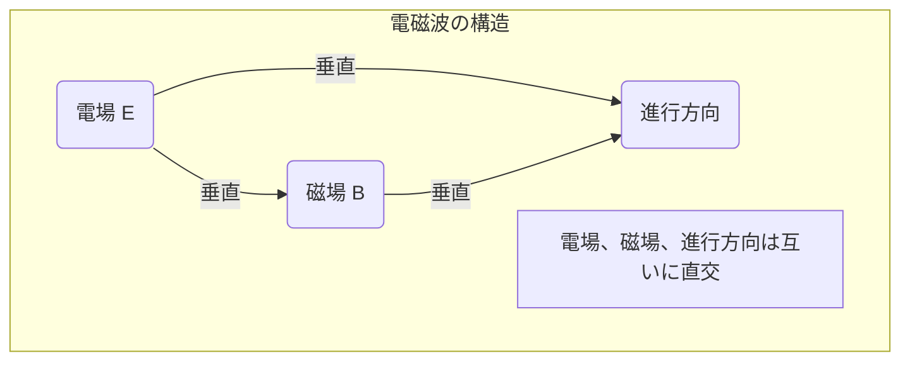

# 電磁気学 第16週: 電磁波とその性質、マクスウェルの方程式入門

---

## この週の学習目標
- 電磁波がどのように発生するか（電場と磁場の相互誘導）を概念的に理解する。
- 電磁波の基本的な性質（横波、真空中での伝播速度、エネルギーを持つなど）を理解する。
- 電磁波のスペクトル（電波、赤外線、可視光線、紫外線、X線、ガンマ線）について知り、それぞれの特徴と利用例を挙げる。
- マクスウェルの方程式が電磁気学を統一する理論であることを知り、その概要に触れる。
- 光が電磁波の一種であることを理解する。

---

## 導入
- これまで電気現象と磁気現象を別々に、そしてそれらの相互作用（電流の磁気作用、電磁誘導など）について学んできました。
- 19世紀後半、イギリスの物理学者マクスウェルは、これらの現象を統一的に記述する一連の方程式（マクスウェルの方程式）を提唱しました。
- この理論から、驚くべきことに「電場と磁場が互いに影響し合いながら空間を波として伝わる」という電磁波の存在が予言されました。そして、その伝播速度は当時知られていた光の速さと一致したのです。
- 今週は、この電磁波の基本的な性質と、電磁気学の集大成ともいえるマクスウェルの方程式について入門的な解説をします。

---

## 1. 電磁波の発生と伝播
### 1.1. 電磁波とは
- 電場と磁場が互いに垂直に振動し、その振動が空間を伝わっていく波。
- 電荷が加速度運動をするとき（例: 振動する電流、アンテナ内の振動する電荷）に発生する。

### 1.2. 電磁波の発生メカニズム（概念）
- **変化する電場は磁場を作る**:
  - コンデンサーの極板間の電場が時間的に変化すると、その周りに変位電流という概念を通じて磁場が誘導される（アンペール・マクスウェルの法則の一部）。
- **変化する磁場は電場を作る**:
  - コイルを貫く磁束が時間的に変化すると、その周りに誘導電場が生じる（ファラデーの電磁誘導の法則）。
- このように、電場の変化が磁場を生み、その磁場の変化がまた新たな電場を生む…という相互作用が連鎖的に起こり、波として空間を伝播していくのが電磁波である。

### 1.3. 電磁波の構造
- 電場ベクトル $\vec{E}$、磁場ベクトル $\vec{B}$、電磁波の進行方向は互いに垂直である（横波）。
- 電場と磁場の振動は同位相。

(実際にはEとBは同じ場所で振動し、それが進行方向に伝播する)

---

## 2. 電磁波の性質
### 2.1. 横波
- 電場と磁場の振動方向が、波の進行方向に対して垂直である。

### 2.2. 真空中での伝播速度（光速）
- 電磁波が真空中を伝わる速さ $c$ は、真空の誘電率 $\varepsilon_0$ と真空の透磁率 $\mu_0$ を用いて次のように表される。
  $c = \frac{1}{\sqrt{\varepsilon_0 \mu_0}}$
- $\varepsilon_0 \approx 8.854 \times 10^{-12} \mathrm{F/m}$
- $\mu_0 = 4\pi \times 10^{-7} \mathrm{N/A^2}$
- これらを代入すると、$c \approx 2.99792458 \times 10^8 \mathrm{m/s}$ (約30万km/s)。
- これは光の速さと一致し、光が電磁波の一種であることが強く示唆された。

### 2.3. 媒質中での伝播速度
- 誘電率 $\varepsilon$、透磁率 $\mu$ の媒質中では、電磁波の速さ $v$ は、
  $v = \frac{1}{\sqrt{\varepsilon \mu}}$
- 屈折率 $n = \frac{c}{v} = \sqrt{\frac{\varepsilon \mu}{\varepsilon_0 \mu_0}} = \sqrt{\varepsilon_r \mu_r}$ ($\varepsilon_r, \mu_r$ は比誘電率、比透磁率)。

### 2.4. エネルギーと運動量を持つ
- 電磁波はエネルギーを運ぶ。単位面積あたりを単位時間に通過するエネルギーを電磁波の強さ（ポインティングベクトルに関連）という。
- 電磁波は運動量も持ち、物体に当たると圧力を及ぼす（光圧、放射圧）。

### 2.5. 反射、屈折、干渉、回折
- 電磁波は波としての一般的な性質（反射、屈折、干渉、回折）を示す。
- これらの現象は、光だけでなく、電波など他の電磁波でも観測される。

---

## 3. 電磁波のスペクトル
- 電磁波は、その波長（または周波数）によって様々な種類に分類される。これらを波長の短い（周波数の高い）順またはその逆に並べたものを電磁波のスペクトルという。
- 波長 $\lambda$、周波数 $f$、速さ $c$ (真空中) の間には $c = f\lambda$ の関係がある。

| 種類        | 波長範囲 (目安)          | 周波数範囲 (目安)        | 主な性質・利用例                                   |
|-------------|--------------------------|--------------------------|----------------------------------------------------|
| ガンマ線 ($\gamma$線) | $< 0.01 \mathrm{nm}$     | $> 3 \times 10^{19} \mathrm{Hz}$ | 原子核反応、放射線治療、宇宙線                       |
| X線         | $0.01 \sim 10 \mathrm{nm}$ | $3 \times 10^{16} \sim 3 \times 10^{19} \mathrm{Hz}$ | レントゲン写真、物質構造解析、空港手荷物検査         |
| 紫外線 (UV) | $10 \sim 400 \mathrm{nm}$  | $7.5 \times 10^{14} \sim 3 \times 10^{16} \mathrm{Hz}$ | 殺菌、日焼け、ビタミンD生成、蛍光作用、偽札鑑定      |
| 可視光線    | $400 \sim 750 \mathrm{nm}$ | $4 \times 10^{14} \sim 7.5 \times 10^{14} \mathrm{Hz}$ | 人間の目で見える光 (紫・藍・青・緑・黄・橙・赤)      |
| 赤外線 (IR) | $750 \mathrm{nm} \sim 1 \mathrm{mm}$ | $3 \times 10^{11} \sim 4 \times 10^{14} \mathrm{Hz}$ | 熱作用、赤外線カメラ、リモコン、暖房、光通信         |
| 電波        | $> 1 \mathrm{mm}$        | $< 3 \times 10^{11} \mathrm{Hz}$ |                                                    |
| 　マイクロ波  | $1 \mathrm{mm} \sim 1 \mathrm{m}$  | $300 \mathrm{MHz} \sim 300 \mathrm{GHz}$ | 電子レンジ、レーダー、衛星通信、Wi-Fi (一部)       |
| 　超短波(VHF)/極超短波(UHF) | $10 \mathrm{cm} \sim 10 \mathrm{m}$ | $30 \mathrm{MHz} \sim 3 \mathrm{GHz}$  | テレビ放送、FMラジオ、携帯電話、無線LAN            |
| 　短波(HF)    | $10 \mathrm{m} \sim 100 \mathrm{m}$ | $3 \mathrm{MHz} \sim 30 \mathrm{MHz}$  | 国際放送、アマチュア無線                             |
| 　中波(MF)    | $100 \mathrm{m} \sim 1 \mathrm{km}$ | $300 \mathrm{kHz} \sim 3 \mathrm{MHz}$ | AMラジオ放送                                       |
| 　長波(LF)    | $> 1 \mathrm{km}$        | $< 300 \mathrm{kHz}$         | 標準電波（時刻）、船舶通信                           |

---

## 4. マクスウェルの方程式 (Maxwell's Equations) 入門
- 電磁気学の基本法則を4つの方程式にまとめたもの。これらの方程式から電磁波の存在と性質が導かれる。
- 高校物理では詳細な数式は扱わないが、各法則が何を意味するかを理解することが重要。

1.  **ガウスの法則（電場について）**: $\oint_S \vec{E} \cdot d\vec{A} = \frac{Q_{in}}{\varepsilon_0}$
    - 意味: 閉曲面を貫く電場の総量は、内部の電荷の総量に比例する。電荷が電場の源である。
    - (磁場には対応する「磁荷」が存在しないため、磁場に関するガウスの法則は $\oint_S \vec{B} \cdot d\vec{A} = 0$ となり、磁力線は必ず閉曲線になることを示す。)

2.  **ガウスの法則（磁場について）**: $\oint_S \vec{B} \cdot d\vec{A} = 0$
    - 意味: 閉曲面を貫く磁場の総量は常にゼロである。単独のN極やS極（磁気単極子、モノポール）は存在しない。磁力線は必ずループを形成する。

3.  **ファラデーの電磁誘導の法則**: $\oint_C \vec{E} \cdot d\vec{l} = -\frac{d\Phi_B}{dt}$
    - 意味: 閉回路に沿った誘導起電力（電場の周回積分）は、その回路を貫く磁束の時間変化率に比例する。変化する磁場は電場（渦電場）を生む。

4.  **アンペール・マクスウェルの法則**: $\oint_C \vec{B} \cdot d\vec{l} = \mu_0 \left( I_{enc} + \varepsilon_0 \frac{d\Phi_E}{dt} \right)$
    - 意味: 閉回路に沿った磁場の周回積分は、その回路を貫く電流（伝導電流 $I_{enc}$）と電束の時間変化率（変位電流 $\varepsilon_0 d\Phi_E/dt$）の和に比例する。電流だけでなく、変化する電場も磁場を生む。
    - マクスウェルは、アンペールの法則に変位電流の項を付け加えることで、理論の矛盾を解消し、電磁波の存在を予言した。

- これらの方程式は、電場と磁場の関係、およびそれらが電荷や電流とどのように関連しているかを完全に記述する。

---

## 例題と解説
### 例題1
- ある電磁波の真空中の波長が $600 \mathrm{nm}$ であった。この電磁波の周波数と、これが電磁波スペクトルのどの領域に属するかを答えよ。光速を $c = 3.0 \times 10^8 \mathrm{m/s}$ とする。
- **解説と解答**
  波長 $\lambda = 600 \mathrm{nm} = 600 \times 10^{-9} \mathrm{m} = 6.0 \times 10^{-7} \mathrm{m}$。
  周波数 $f = \frac{c}{\lambda} = \frac{3.0 \times 10^8 \mathrm{m/s}}{6.0 \times 10^{-7} \mathrm{m}} = 0.5 \times 10^{15} \mathrm{Hz} = 5.0 \times 10^{14} \mathrm{Hz}$。
  この波長・周波数は可視光線（橙色～黄色あたり）の領域に属する。

---

## 演習問題
1. 電磁波の発生原理を、「変化する電場」と「変化する磁場」の相互作用という観点から説明せよ。
2. FMラジオ放送の周波数が $80 \mathrm{MHz}$ であるとき、その電波の真空中の波長を求めよ。
3. マクスウェルの方程式のうち、ファラデーの電磁誘導の法則とアンペール・マクスウェルの法則が、電磁波の伝播においてどのような役割を果たしているか、簡単に説明せよ。

---

## まとめ
- 電磁波は、変化する電場と磁場が互いに影響し合いながら空間を伝わる横波である。
- 真空中での速さは光速 $c = 1/\sqrt{\varepsilon_0 \mu_0}$ に等しい。
- 電磁波は波長（周波数）によって分類され、電波からガンマ線まで広範なスペクトルを形成する。光も電磁波の一種。
- マクスウェルの方程式は、電磁気学の現象を統一的に記述し、電磁波の存在を理論的に導いた。
- これで高校物理における電磁気学の主要なトピックは一通り学びました。残りの週では、これらの知識を総合的に用いる問題演習や、発展的な内容に触れることがあります。

---

## 参考資料
- 高校物理の教科書（電磁気分野）
- (その他参考書やウェブサイトなど)
