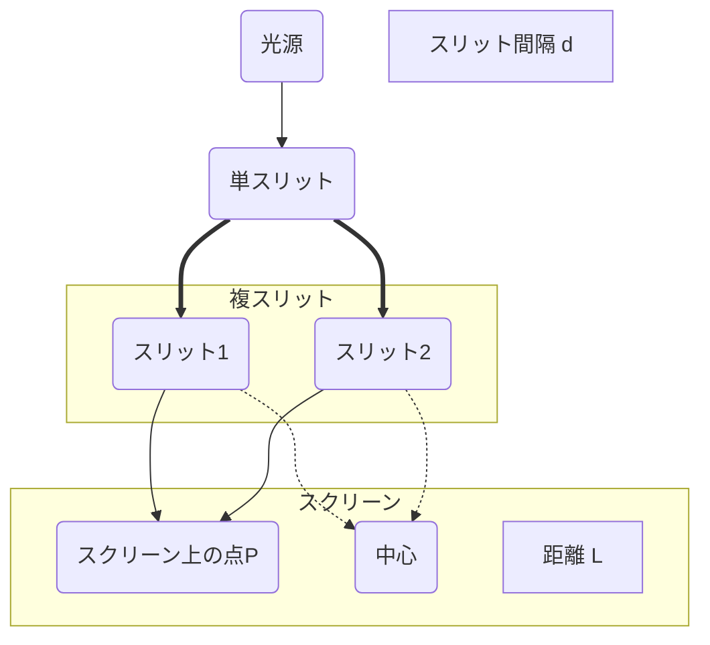

# 電磁気学 第32週: 波動光学入門（光の干渉、ヤングの実験、回折格子）

---

## この週の学習目標
- 光が波としての性質（干渉、回折）を持つことを再確認する。
- 光の干渉が起こる条件（コヒーレントな光）について理解する。
- ヤングの実験（二重スリット実験）の原理を理解し、明線・暗線が生じる条件式を導出・適用できるようになる。
- 光路差と位相差の関係を理解する。
- 回折格子の原理を理解し、明線が生じる条件式を導出・適用できるようになる。
- 薄膜干渉（シャボン玉の色など）の基本的な考え方に触れる。

---

## 導入
- これまで、光については幾何光学（光の直進、反射、屈折）や、光電効果・コンプトン効果（光の粒子性）、電磁波としての一面などを学んできました。
- しかし、光の最も基本的な性質の一つは「波」としての振る舞いです。波に特有の現象である「干渉」や「回折」は、光でも顕著に観測され、光の本質を理解する上で非常に重要です。
- 今週からは数週にわたり、この「波動光学」の分野に入ります。まずは、光の干渉現象の代表例であるヤングの実験と、多数のスリットを利用した回折格子について学び、光が波としてどのように振る舞うかを詳しく見ていきます。

---

## 1. 光の干渉 (Interference of Light)
### 1.1. 干渉とは
- 複数の波が同じ場所で重なり合うとき、波が強め合ったり弱め合ったりする現象。
- 光が波であることの強力な証拠の一つ。

### 1.2. 干渉が起こるための条件（コヒーレントな光）
- 干渉縞（明暗のパターン）が安定して観測されるためには、重ね合わせる光が以下の条件を満たす必要がある（コヒーレントな光）。
  1.  **同じ振動数（同じ波長、同じ色）であること。**
  2.  **位相がそろっているか、または位相差が一定であること。**
- 通常の光源（太陽光、電球など）は多数の原子がバラバラに光を出すため、コヒーレントではない。
- コヒーレントな光を得る方法:
  - 1つの光源から出た光を2つ以上に分ける（例: ヤングの実験、薄膜干渉）。
  - レーザー光（非常にコヒーレントな光を出す光源）。

### 1.3. 波の重ね合わせの原理
- 複数の波が同じ点で重なるとき、その点の変位は、各々の波が単独で存在した場合の変位のベクトル和に等しい。

### 1.4. 強め合い（明線）と弱め合い（暗線）の条件
- 2つの波源 S$_1$, S$_2$ から出た同じ波長 $\lambda$ の光が、ある点Pで干渉する場合を考える。
- **光路差 (Path Difference)**: 点Pまでの経路の差 $\Delta L = |L_1 - L_2|$ ($L_1 = \mathrm{S_1P}$, $L_2 = \mathrm{S_2P}$)。
- **位相差 (Phase Difference)**: 点Pでの2つの波の位相のずれ $\delta$。光路差 $\Delta L$ との関係は $\delta = \frac{2\pi}{\lambda} \Delta L$。

- **強め合い（明線）の条件**: 2つの波が同位相で重なる。
  - 光路差 $\Delta L = m\lambda$  ($m = 0, 1, 2, \dots$) (波長の整数倍)
  - 位相差 $\delta = 2m\pi$
- **弱め合い（暗線）の条件**: 2つの波が逆位相で重なる。
  - 光路差 $\Delta L = (m + \frac{1}{2})\lambda$  ($m = 0, 1, 2, \dots$) (波長の半整数倍)
  - 位相差 $\delta = (2m+1)\pi$

---

## 2. ヤングの実験 (Young's Double-Slit Experiment, 1801年)
- トーマス・ヤングが行った、光の波動性（干渉）を初めて明確に示した実験。
### 2.1. 実験装置
- 単一光源からの光を、まず単スリットS$_0$に通し（波面をそろえるため）、次に近接した2つの平行なスリットS$_1$, S$_2$（複スリット）に通す。
- 複スリットから距離 $L$ だけ離れたスクリーン上に干渉縞（明暗の縞模様）が観測される。
- S$_1$, S$_2$ はコヒーレントな波源として働く。スリット間隔を $d$ とする。

### 2.2. 明線・暗線の位置
- スクリーン中心Oから距離 $x$ の点Pを考える。
- 通常、$L \gg d$ かつ $L \gg x$ の近似が用いられる。
- 光路差 $\Delta L \approx d \sin\theta \approx d \frac{x}{L}$  (ここで $\theta$ はOからPを見た角度)。
- **明線の条件**: $\Delta L = d \frac{x}{L} = m\lambda$
  $x_m = m \frac{L\lambda}{d}$  ($m=0, 1, 2, \dots$)
  - $m=0$ (中心O) は中央明線。
- **暗線の条件**: $\Delta L = d \frac{x}{L} = (m + \frac{1}{2})\lambda$
  $x'_m = (m + \frac{1}{2}) \frac{L\lambda}{d}$  ($m=0, 1, 2, \dots$)
- **明線間隔（縞間隔） $\Delta x$**: 隣り合う明線（または暗線）の間隔。
  $\Delta x = x_{m+1} - x_m = \frac{L\lambda}{d}$
  - 縞間隔は、波長 $\lambda$ とスクリーンまでの距離 $L$ に比例し、スリット間隔 $d$ に反比例する。

---

## 3. 回折格子 (Diffraction Grating)
### 3.1. 回折格子とは
- ガラス板や金属板の表面に、多数の平行な溝を等間隔に精密に刻んだもの。
- 各溝（または溝と溝の間）がスリットとして働き、透過型または反射型の多スリット干渉を生じさせる。
- **格子定数 (Grating Constant) $d$**: 隣り合うスリット（溝）の間隔。
  (例: 1mmあたりに100本の溝があれば、$d = 1\mathrm{mm}/100 = 0.01\mathrm{mm} = 10\mu\mathrm{m}$)

### 3.2. 明線（回折光）の条件
- 回折格子に垂直に平行な単色光（波長 $\lambda$）を入射させる。
- 格子を透過（または反射）した光が、入射方向から角度 $\theta$ の方向に進んで干渉し、強め合う条件を考える。
- 隣り合うスリットからの光の光路差は $d\sin\theta$。
- 多数のスリットからの光がすべて同位相で強め合うためには、この光路差が波長の整数倍であればよい。
  $d\sin\theta = m\lambda$  ($m = 0, \pm 1, \pm 2, \dots$)
  - $m$: 回折光の次数。
  - $m=0$: 0次回折光（直進光）。$\theta=0$。すべての波長で強め合う。
  - $m=\pm 1$: 1次回折光。
  - $m=\pm 2$: 2次回折光。
- この条件を満たす特定の角度 $\theta$ の方向に明るい線（スペクトル線）が観測される。

### 3.3. 回折格子の特徴と応用
- **スペクトル分解**:
  - 白色光（様々な波長の光が混ざった光）を回折格子に入射させると、明線の条件式 $d\sin\theta = m\lambda$ より、波長 $\lambda$ によって強め合う角度 $\theta$ が異なるため、光が波長ごとに分離される（スペクトルが得られる）。
  - プリズムによる分散と似ているが、回折格子の方が波長分解能が高いことが多い。
- **応用**: 分光器（物質のスペクトル分析）、CDやDVDの記録面の虹色、構造色など。

---

## 4. 薄膜干渉 (Thin-Film Interference)
### 4.1. 現象
- シャボン玉の膜や水面に浮いた油膜などが、様々な色に色づいて見える現象。
- 薄い膜の表面で反射する光と、膜の裏面で反射する光（または膜を透過する光）とが干渉することによって起こる。

### 4.2. 光路差と位相の変化
- **光路差**: 膜の厚さ $d$、屈折率 $n$、入射角 $i$、屈折角 $r$ などによって決まる。
  - 垂直入射に近い場合、膜の表面での反射光と裏面での反射光の光路差は近似的に $2nd$。
- **位相の変化**:
  - 光が屈折率の小さい媒質から大きい媒質へ入射して反射するとき、位相が $\pi$ (半波長分) ずれる。
  - 光が屈折率の大きい媒質から小さい媒質へ入射して反射するとき、位相はずれない。
- これらの光路差と位相変化を考慮して、干渉条件（強め合い・弱め合い）が決まる。
- 波長によって強め合う条件が異なるため、白色光を当てると特定の色が強調されて見える。

---

## 例題と解説
### 例題1
- ヤングの実験で、スリット間隔 $d = 0.20 \mathrm{mm}$、スクリーンまでの距離 $L = 1.0 \mathrm{m}$ のとき、波長 $\lambda = 6.0 \times 10^{-7} \mathrm{m}$ の単色光を用いた。
  (1) 中央明線から数えて2番目の明線 ($m=2$) の位置 $x_2$ を求めよ。
  (2) 明線間隔 $\Delta x$ を求めよ。
- **解説と解答**
  $d = 0.20 \mathrm{mm} = 2.0 \times 10^{-4} \mathrm{m}$
  (1) $x_m = m \frac{L\lambda}{d}$ より、
      $x_2 = 2 \times \frac{1.0 \mathrm{m} \times 6.0 \times 10^{-7} \mathrm{m}}{2.0 \times 10^{-4} \mathrm{m}} = 2 \times \frac{6.0 \times 10^{-3}}{2.0} \mathrm{m} = 6.0 \times 10^{-3} \mathrm{m} = 6.0 \mathrm{mm}$。
  (2) $\Delta x = \frac{L\lambda}{d} = \frac{1.0 \mathrm{m} \times 6.0 \times 10^{-7} \mathrm{m}}{2.0 \times 10^{-4} \mathrm{m}} = 3.0 \times 10^{-3} \mathrm{m} = 3.0 \mathrm{mm}$。

### 例題2
- 格子定数が $2.0 \times 10^{-6} \mathrm{m}$ の回折格子に、波長 $\lambda$ の単色光を垂直に入射させたところ、1次の明線が $\theta = 30^\circ$ の方向に現れた。この光の波長 $\lambda$ を求めよ。
- **解説と解答**
  明線の条件 $d\sin\theta = m\lambda$。
  $m=1$, $\theta=30^\circ$, $d=2.0 \times 10^{-6} \mathrm{m}$。
  $\sin 30^\circ = 0.5$。
  $(2.0 \times 10^{-6} \mathrm{m}) \times 0.5 = 1 \times \lambda$
  $\lambda = 1.0 \times 10^{-6} \mathrm{m} = 1000 \mathrm{nm}$。

---

## 演習問題
1. ヤングの実験で、赤色の光（波長 $\lambda_R$) と青色の光（波長 $\lambda_B$, $\lambda_R > \lambda_B$) を用いた場合、明線間隔はどちらが大きいか。理由とともに答えよ。
2. 回折格子に白色光を入射させたとき、0次の明線は白色に見えるが、1次以上の明線はなぜ色に分かれて見えるのか説明せよ。また、1次のスペクトルでは、赤色と紫色（波長が短い）のどちらがより大きな角度で回折されるか。
3. 厚さ $d$、屈折率 $n$ の薄膜に、空気中から光が垂直に入射する場合を考える。膜の上面での反射光と下面での反射光が干渉して強め合う条件を、光路差と位相変化を考慮して求めよ（空気の屈折率を1とする）。

---

## まとめ
- 光の干渉は、複数のコヒーレントな光波が重なり合い、強め合ったり弱め合ったりする現象である。
- ヤングの実験では、複スリットからの光の干渉により、スクリーン上に明暗の縞模様が生じる。明線条件: $d \frac{x}{L} = m\lambda$。
- 回折格子は、多数の等間隔スリットによる干渉を利用し、光を波長ごとに分光する。明線条件: $d\sin\theta = m\lambda$。
- 薄膜干渉は、膜の表面と裏面からの反射光の干渉であり、シャボン玉の虹色などの原因となる。
- これらの現象は、光が波動としての性質を持つことを強く示している。
- 次週は「光の回折と偏光」について学び、波動光学の理解をさらに深めます。

---

## 参考資料
- 高校物理の教科書（波動分野）
- (その他参考書やウェブサイトなど)
